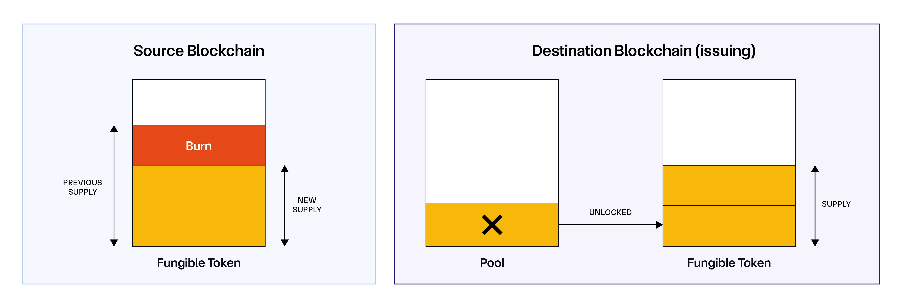
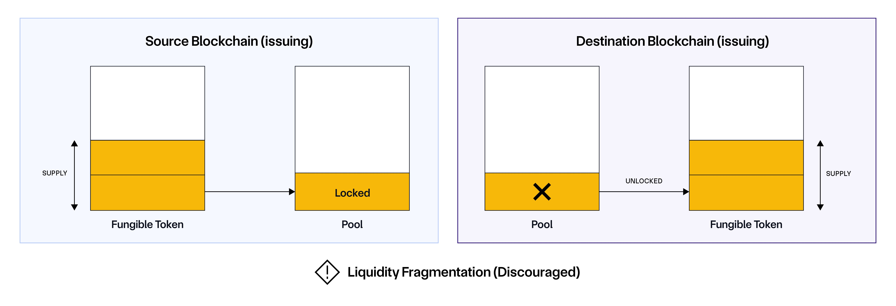

# Foundry Cross Chain Rebase Token

## Git Hooks

用 git hook 在 commit 之前将 `lib` 文件夹移出 git 工作区，避免提交，创建 `.git/hooks/pre-commit` 文件

```shell
#!/bin/bash

# 完整的 pre-commit hook
echo "🔧 Running pre-commit checks..."

# 移除 lib 目录的缓存
if [ -d "lib" ]; then
    if git ls-files --cached lib/ | grep -q .; then
        git rm -r --cached lib/ > /dev/null 2>&1
        echo "✓ Removed lib/ from git cache"
        
        # 重新添加 .gitignore 以确保配置正确
        if [ -f ".gitignore" ]; then
            git add .gitignore
        fi
    else
        echo "ℹ lib/ already not in cache"
    fi
fi

# 可以在这里添加其他 pre-commit 检查
# 例如: npm test, linting, etc.

echo "✅ Pre-commit checks completed"
exit 0
```

修改为可执行

```shell
chmod .git/hooks/pre-commit +x
```


## ChainLink CCIP

### 相关资源

官方文档：https://docs.chain.link/ccip#overview

跨链桥：https://docs.chain.link/resources/bridge-risks#overview

CCT：https://docs.chain.link/ccip/concepts/cross-chain-token

CCT 部署教程：https://docs.chain.link/ccip/tutorials/evm/cross-chain-tokens/register-from-eoa-burn-mint-foundry

EVM CCIP 文档：https://docs.chain.link/ccip/getting-started/evm

CCIP Directory：https://docs.chain.link/ccip/directory/mainnet

Link Token Address：https://docs.chain.link/resources/link-token-contracts

CCIP Explorer：https://ccip.chain.link/

Chainlink Local 教程：https://docs.chain.link/chainlink-local/build/ccip/foundry

示例代码：[ccip-cct-starter](https://github.com/Cyfrin/ccip-cct-starter)

### CCIP 简介

CCIP 指的是 **cross-chain interoperability protocol**，是一个通用的跨链数据传输协议，可以用于发送跨链消息、转移资产及代币等，主要功能如下：

- Arbitrary Messaging
- Token Transfer
- Programmable Token Transfer

### CCIP 及 CCT 解决的问题

> 官方文档：https://docs.chain.link/ccip/concepts/cross-chain-token/overview#motivations

> Fragment Liquidity 的解释可以看 [这里](assets/FragmentLiquidity.md)

- 传统跨链桥的安全问题
- Token 及 Token Pool 自治权
- Token 流动性碎片化问题

### 使用场景

- Cross-chain lending: Chainlink CCIP enables users to lend and borrow a wide range of crypto assets across multiple DeFi platforms running on independent chains.
- Low-cost transaction computation: Chainlink CCIP can help offload the computation of transaction data on cost-optimized chains.
- Optimizing cross-chain yield: Users can leverage Chainlink CCIP to move collateral to new DeFi protocols to maximize yield across chains.
- Creating new kinds of dApps: Chainlink CCIP enables users to take advantage of network effects on certain chains while harnessing compute and storage capabilities of other chains.

### 怎么理解 L1、L2、跨链桥

As an analogy, you can use the blockchains as cities mental model:

- Layer-1 blockchains are like **cities**.
- Layer-2 solutions are equivalent to **skyscrapers**. As described in the mental model, “Each rollup is like a vertical blockchain that extends from the ground L1”.
- Bridges are like **roads and streets** that connect different cities and skyscrapers.

### Token pool

跨链逻辑的执行器、状态的守护者和通信的端点，具体看 [这里](assets/TokenPool.md)

- 执行跨链资产转移的逻辑
- 资产托管与记账
- 权限管理与访问控制
- 可升级性与配置管理
- 充当统一的链上接口

### Token 传输方式分类

> 关于 burn-mint 和 lock-unlock 两种模式在多发行源上的问题，可以看 [这里](assets/BurnMintAndLockUnlock.md)

#### Burn and Mint

在 Source Chain 销毁，在 Destination Chain 铸造


#### Lock and Mint

在 Source Chain 锁定，在 Destination Chain 铸造，适用于从发行链转到其他链


#### Burn and Unlock

在 Source Chain 销毁，在 Destination Chain 解锁，适用于从其它链转回发行链



#### Lock and Unlock

不推荐，在 Source Chain 锁定原生代币，但在 Destination Chain 上解锁的实际上是原生代币的 **兑换券**，本质上是抵押。这种方式会导致同时存在多条链都可以成为代币的 **发行方**，会造成代币的 **流动性碎片化 (Fragment Liquidity)**



## Circle CCTP

### 相关资源

Circle 官方文档：https://developers.circle.com/cctp

示例代码：[cctp-v1-ethers](https://github.com/ciaranightingale/cctp-v1-ethers#)

CCTP 使用 burn-mint 模式，允许用户在多个链上传输 USDC

传统跨链桥使用 lock-mint 模式，在发行链上锁定 USDC，在目标链上铸造 USDC.e，本质上是个借条

- 每个链上会有不同版本的 USDC 借条，会增加复杂性
- 由于原 USDC 被锁定，而借条在各个链上单独流通，会造成流通碎片化
- 跨链操作完全依赖跨链桥，存在信任风险

## CCT 代币部署

### 安装依赖

安装 CCIP

```shell
forge install smartcontractkit/ccip@v2.17.0-ccip1.5.16
```

安装 Chainlink Local，可以本地启动 Chainlink Oracle 网络用于测试

```shell
forge install smartcontractkit/chainlink-local@v0.2.5-beta.0
```

### 启动本地 Anvil

Fork ethereum sepolia

```shell
anvil --port 8545 --fork-url $ETH_SEPOLIA_RPC_URL --chain-id 11155111
```

Fork arbitrum sepolia

``` shell
anvil --port 8546 --fork-url $ARB_SEPOLIA_RPC_URL --chain-id 421614
```

### 需要注意的坑

调用 `ccipLocalSimulatorFork` 中的 `switchChainAndRouteMessage()` 方法时，不能提前手动切换到目标 fork，否则可能会报错

```solidity
ccipLocalSimulatorFork.switchChainAndRouteMessage(arbSepoliaAnvilForkId);
```

`.env` 文件在 Windows 系统下可能存在一些不可见字符，导致引用环境变量时出现问题，需要转为 unix 格式

```shell
sed -i 's/\r$//' .env
```

### 发送跨链代币

#### Ethereum Sepolia

- MiaoToken: `0x1a596EF4c034A66CBA457C87260b119988cd4Fe7`
- MiaoTokenPool: `0x26c39daf444c0653bac7611153481500754655e3`
- Vault: `0x8bbbabf2b0a7302df27b2b997331276926b90a1b`

#### Arbitrum Sepolia

- MiaoToken: `0x0756a4434da1bfe16e2e29fe0dc7f7b7df4745af`
- MiaoTokenPool: `0x0273c4b1e2682d0c317a1571aa16f060cf6c5192`
- Vault: `0x5fc0d8d815c1697bb63d4074de66456157549876`

#### 验证合约

```shell
forge verify-contract $(ADDR) $(NAME) --chain $(CHAIN) --verifier etherscan --etherscan-api-key $(ETHERSCAN_API_KEY)
```

#### 跨链消息

0x6dd1c8e70d3db695fed2623469f0fc025d415672d132e4c0b2f829bd48ebb5a7
0x0a542099dec24b754dc9e6b58a2c01be9813d000c3955d90c878e6ce0d7d3478
0x30ed2151b2bb7590c7ebc0309a058e0200c35ba38aa3bf80a11fd9868eb115b7
